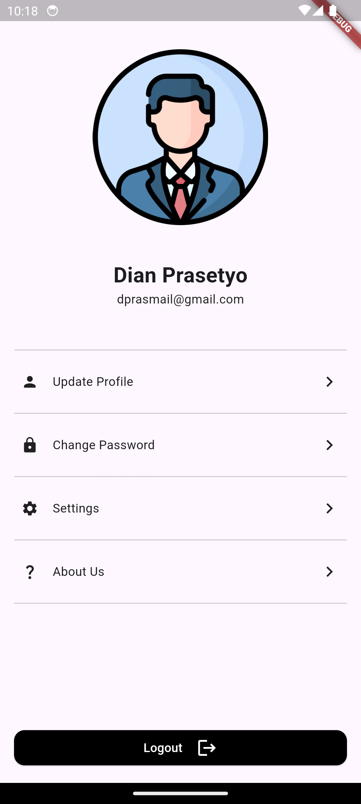

# flutter_fundamental

Belajar basic widget dart

- Buatlah project flutter baru
- Buatlah 1 halaman dengan tampilan seperti gambar di bawah.
- Cara penyusunan widget bebas.
- Tampilah boleh dikreasikan, tidak harus sama persis.

## Screenshoot

