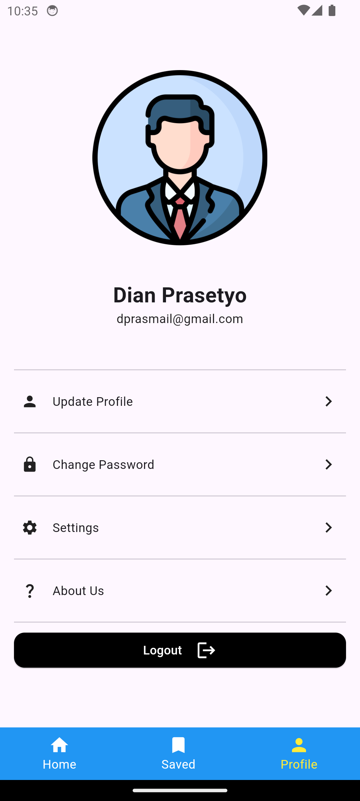

# flutter_fundamental

Tugas layouting dan navigation

- Buatlah 3 halaman, contoh seperti di halaman selanjutnya, boleh di improve, tidak harus sama persis.
- Terapkan navigasi dengan BottomNavigaionBar dan PageView.
- Tambahkan Screenshoot tiap page kalian pada README.md

## Screenshoot

